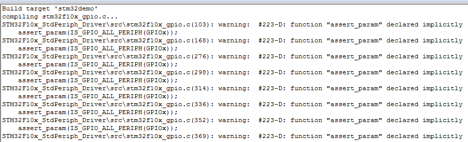
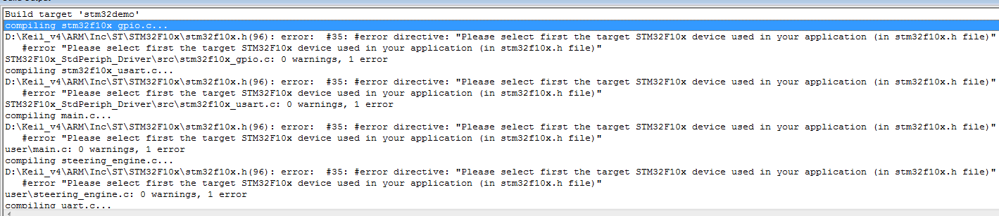
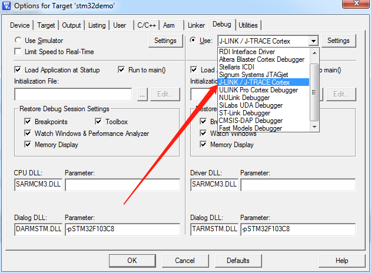
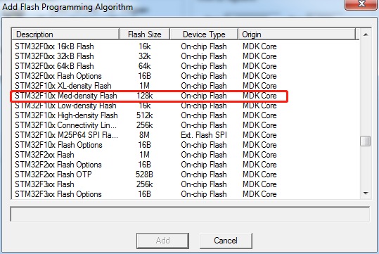
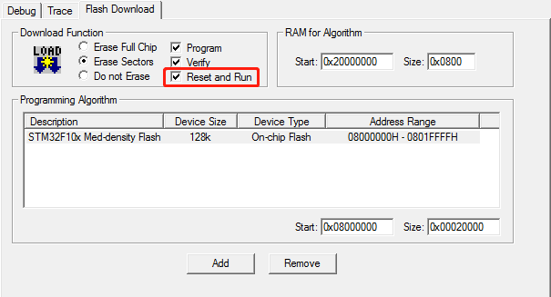
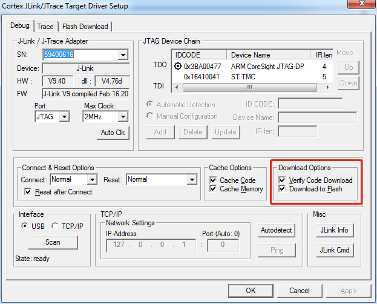

# stm32 学习笔记

## 硬件条件：

- STM32F103C8T6 最小系统控制板 (http://pan.baidu.com/s/1geHfIE3)	
- ULN2003驱动板5V测试模块板 + 5线4相减速步进电机 (http://pan.baidu.com/s/1boXz89T, http://pan.baidu.com/s/1i52v0FF)
- CH340G USB 转串口工具

## 已有功能：

1. 板载 LED 灯(D2) 频闪
2. 舵机的正反转

        舵机接线规则：
        IN1(A) ---- PB5
        IN2(B) ---- PB6
        IN3(C) ---- PB7
        IN4(D) ---- PB8
        +      ---- +5V
        -      ---- GND
        
        电机导通相序(此处有疑问)：
        正向：A-B-C-D(demo:D-C-B-A)
        反转：D-C-B-A(demo:A-B-C-D)

3. 串口通信

        通过转串口工具令 PC 与板子通信，使用 0 和 非0 来控制 LED 的开关，并返回 'off' 和 'on'

## Keil for stm32 配置事项

### 编译链接

1. 出现下述错误时，检查 Option->C/C++选项页中的Preprocessor Symbols 中 Define 项中是否定义了 **USE_STDPERIPH_DRIVER**
   
   

2. 出现下图错误时，同样在1中的位置检查是否定义了 **STM32F10X_MD**，注意此配置与具体设备相关，不一定都是‘MD’。

   

3. 需要手动将 stm32f10x_config.h 导入工程，可以自己创建，也可从其他demo中复制粘贴。

### Jlink 

1. 选择图中的这个选项。

   

2. [STM32F103C8T6](https://www.st.com/en/microcontrollers/stm32f103c8.html) 芯片为64k flash，在选择 **Flash Programming Algorithm** 时，可能没有相应**Flash Size**的算法，此时选择**128K**即可。

   

3. 代码烧写至芯片后，代码不会立即运行，需要重新上电才能运行，此时在添加算法的窗口勾选**Reset and Run**。
   
   

4. debug模式下不能进入主函数，但是直接把代码烧写至芯片时可正常运行，则在 Jlink 的 Setting 界面中把 **Download Options**下的两个选项全部勾选。

   
